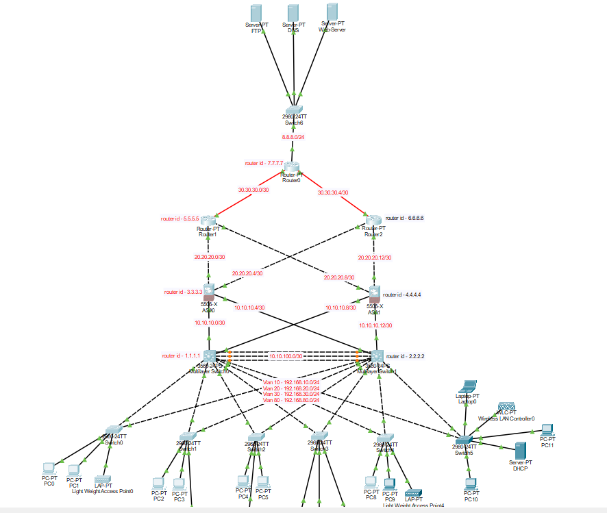

<!-- Header -->
<p align="center">
  
</p>

---

### 🌐 Project Overview
This repository contains a **complete organizational network infrastructure** designed and implemented in **Cisco Packet Tracer**.  
The project demonstrates core networking concepts and real-world enterprise-level configurations, including **VLANs, Inter-VLAN Routing, EtherChannel, VPN setup, and advanced security**.

---

### 🖼️ Network Topology
<p align="center">
  
</p>

---

### ⚡ Implemented Features
- 🖧 **VLANs Configuration**  
  - Segregated departments: IT, Management, Delivery, etc.  
  - Reduced broadcast domains & improved security  

- 🔀 **Inter-VLAN Routing**  
  - Enabled communication between VLANs using Layer 3 routing  

- 🔗 **EtherChannel**  
  - Configured link aggregation for high availability & redundancy  
  - Load balancing between switches  

- 🔒 **VPN Configuration**  
  - Secure remote access for external employees  
  - Encrypted tunnels for sensitive data transfer  

- ⚙️ **Basic Configurations**  
  - IP addressing scheme  
  - Router IDs & hostname setup  
  - Static/Dynamic routing protocols  

---

### 🛠️ Technologies & Tools
<p align="center">
  
  
  
  
  
</p>

---

### 📂 Repository Structure
```bash
🏢 Organization_Networking_Cisco
├── topology.png       # Full network topology
├── configs/           # Router & switch configuration files
├── documentation/     # Detailed explanation of VLAN, VPN, EtherChannel
└── Organization_Network.pkt  # Cisco Packet Tracer project file
